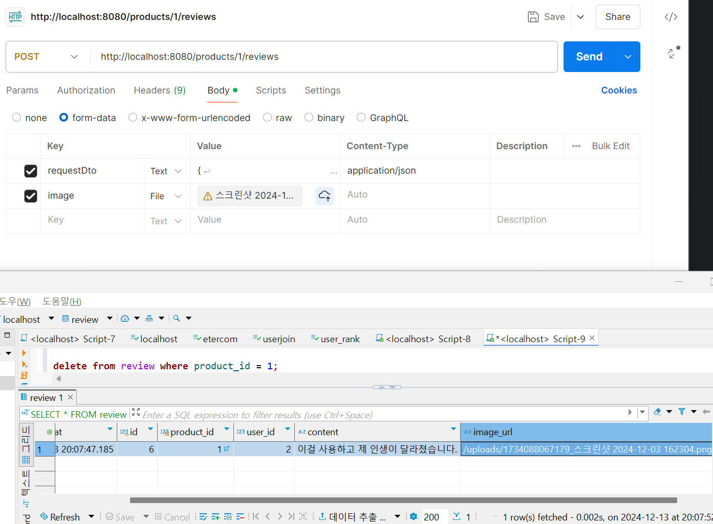

# 개인 기업과제 프로젝트 1번 : 리뷰 서비스
- 개발환경 : SpringBoot, Spring Data JPA, MySql, Docker, DBeaver
- 팀 스터디 8조 : 김민주, 정닛시, 양한서

## 프로젝트 설명

- 상품에 대한 review를 작성하고, 상품별 review 점수, 개수, 그리고 리뷰 내용을 관리합니다.
- 클라우드 환경에서의 배포는 고려하지 않는다.
- docker-compose 기반으로 필요한 인프라 설정을 한다.
- DB 스키마는 요구 사항을 만족할 수 있게 설계하되, 인덱스를 설정해 성능에 문제가 없도록 만들어야 한다.
- 데이터를 persistent 하게 저장해야 하는 데이터베이스는 MySql 만 고려하고, 이외 데이터베이스는 고려하지 않는다.
- 대용량 트래픽이 예상되는데 DynamoDB 나 Cassandra 계열을 사용하는 등의 문제 해결 방식은 허용하지 않는다.
__ __ __ __ __ __ __

## 비즈니스 요구 사항

- 리뷰는 존재하는 상품에만 작성할 수 있습니다.
- 유저는 하나의 상품에 대해 하나의 리뷰만 작성 가능합니다.
- 유저는 1~5점 사이의 점수와 리뷰를 남길 수 있습니다.
- 사진은 선택적으로 업로드 가능합니다.
- 리뷰는 '가장 최근에 작성된 리뷰' 순서대로 조회합니다.
__ __ __ __ __ __ __

## 기술적 요구 사항

- Mysql 조회 시 인덱스를 잘 탈 수 있게 설계
- 상품 테이블에 reviewCount 와 score 가 잘 반영되어야 한다.
- 많은 유저들이 동시에 리뷰를 작성할 때, 발생할 수 있는 동시성 처리를 고려하여 구현해야 합니다.
- 테스트 코드를 작성
__ __ __ __ __ __ __

### 데이터 모델링 Entity

`Product` Entity

```
public class Product {
    @Id
    @GeneratedValue(strategy = GenerationType.IDENTITY)
    private Long id;

    private String name;

    private int reviewCount;

    private float score;
}
```

`Review` Entity

```
public class Review {

    @Id
    @GeneratedValue(strategy = GenerationType.IDENTITY)
    private Long id;

    @ManyToOne(fetch = FetchType.LAZY)
    @JoinColumn(name = "product_id", nullable = false)
    private Product product;

    private Long userId;

    private int score;

    private String content;

    private String imageUrl;

    private LocalDateTime createdAt = LocalDateTime.now();

    @Builder
    public Review(ReviewRequestDto requestDto, Product product, String imageUrl) {
        this.product = product;
        this.userId = requestDto.getUserId();
        this.score = requestDto.getScore();
        this.content = requestDto.getContent();
        this.imageUrl = imageUrl;
    }
}
```

__ __ __ __ __ __ __

# 트러블 슈팅 사례

## 1. Docker 환경 설정

### 문제
- 프로젝트 초기 Docker 환경 설정 과정에서 오류 발생했습니다.
- `docker-compose.yml`에 민감한 DB 정보가 포함되어 Git에 업로드될 위험하다고 생각했습니다.

### 해결
- `docker-compose.yml` 파일을 수정하여 민감 정보는 `.gitignore` 파일로 분리.
- `docker-compose.yml` 설정을 통해 MySQL과 Spring Application 컨테이너를 독립적으로 구동하도록 구성.
- 네트워크 연결 문제는 `networks` 설정으로 해결.

### 도커 명령어

```
docker run -d -p 3306:3306 -e MYSQL_ROOT_PASSWORD=1234 --name mysql mysql

docker images

docker exec -it mysql bash

docker rm -f $(docker ps -aq)
```

dockerfile

```
FROM openjdk:17-jdk
WORKDIR /app

COPY build/libs/review-0.0.1-SNAPSHOT.jar app.jar
EXPOSE 8080
ENTRYPOINT ["java", "-jar", "app.jar"]
```

docker-compose.yml

```
services:
  database:
    container_name: mysql_db
    image: mysql
    restart: unless-stopped
    environment:
      MYSQL_ROOT_PASSWORD: ****
      MYSQL_DATABASE: review
    ports:
      - "3307:3306"
    volumes:
      - ./mysql/conf.d:/etc/mysql/conf.d # MySQL 설정 파일 위치
    command:
      - "mysqld"
      - "--character-set-server=utf8mb4"
      - "--collation-server=utf8mb4_general_ci"
    networks:
      - test_network

  application:
    container_name: docker-compose-test
    restart: on-failure
    build:
      context: ./
      dockerfile: Dockerfile
    ports:
      - "8080:8080"
    environment:
      SPRING_DATASOURCE_URL: jdbc:mysql://mysql_db:3306/review?useSSL=false&allowPublicKeyRetrieval=true
      SPRING_DATASOURCE_USERNAME: "root"
      SPRING_DATASOURCE_PASSWORD: "****"
    depends_on:
      - database
    networks:
      - test_network

networks:
  test_network:

```

### 참고 ref
- https://jandari91.tistory.com/104

---

## 2. Entity 설계 문제

### 문제
- JSON 파일에 명시된 데이터 구조를 잘못 이해하여 불필요한 칼럼을 추가하는 실수를 하였습니다.
- 결과적으로 데이터 조회 시 예상한 결과와 일치하지 않는 문제가 발생했습니다.

### 해결
- 제공된 JSON 데이터 구조를 재검토하여 불필요한 칼럼 제거하였습니다.
- `Product`와 `Review` 엔티티를 JSON 구조에 맞게 수정하였습니다.
- `Review`와 `Product` 간 N:1 관계를 명시적으로 설정하여 데이터 일관성을 유지하였습니다.

### 느낀점
- 요구사항과 데이터 구조를 정확히 이해하고, 개발 전에 설계를 철저히 검토해야 함.

---

## 3. DTO 선언 문제

### 문제
- 초기 `ReviewRequestDto` 설계에서 필요한 필드(`imageUrl`, `createdAt`)를 누락하여 POST API 테스트 중 `NullPointerException` 발생.

### 해결
- 누락된 필드를 추가하였습니다.
- Postman으로 API 테스트를 반복적으로 실행하여 문제 해결 완료.

### 느낀점
- DTO 설계는 API 사양을 철저히 검토한 후 진행해야 하며, 테스트를 통해 설계의 문제점을 조기에 발견하는 것이 중요함.

---

## 4. 이미지 URL 처리 문제

### 문제
- 이미지 업로드 기능이 제대로 구현되지 않아 리뷰 작성 시 `/dummy/image/url` 같은 더미 URL이 저장되는 문제가 발생하였습니다.

### 해결
1. 파일 업로드 디렉토리를 `uploads`로 설정하고, 디렉토리가 없으면 자동으로 생성되도록 수정.
2. 업로드된 파일 이름에 타임스탬프를 추가하여 중복 파일명을 방지.
3. 파일 저장 후 URL을 동적으로 생성하여 저장.
4. 이미지 저장 로직에서 발생할 수 있는 예외를 처리하여 안정성을 확보.

### 느낀점
- 파일 업로드 기능을 구현할 때는 파일 중복, 경로 설정, 예외 처리 등을 사전에 고려해야 하며, 로컬 파일 저장과 URL 매핑 로직을 명확히 설계해야 함.

### 스크린샷 

- POSTMAN 리뷰 작성 시 Image URL 정상 호출 화면



### 코드

- FileInfo.java
```
public class FileInfo {
    private String fileName;
    private byte[] data;

    public FileInfo(String fileName, byte[] data) {
        this.fileName = fileName;
        this.data = data;
    }
}
```

- ReviewService.java

```
String imageUrl = null;
if (image != null && !image.isEmpty()) {
    try {
        // 파일 저장 디렉토리 설정 (예: "uploads" 디렉토리)
        String uploadDir = "uploads";
        Path uploadPath = Paths.get(uploadDir);

        // 디렉토리가 없으면 생성
        if (!Files.exists(uploadPath)) {
            Files.createDirectories(uploadPath);
        }

        // 파일 이름 설정 (중복 방지를 위해 UUID 추가)
        String fileName = System.currentTimeMillis() + "_" + image.getOriginalFilename();
        Path filePath = uploadPath.resolve(fileName);

        // 파일 저장
        Files.copy(image.getInputStream(), filePath, StandardCopyOption.REPLACE_EXISTING);

        // 파일 URL 생성 (서버 경로에 따라 수정 필요)
        imageUrl = "/uploads/" + fileName; // 웹에서 접근 가능한 경로로 설정
    } catch (Exception e) {
        throw new IllegalStateException("파일 업로드 중 오류가 발생했습니다", e);
    }
}
```

---

## 5. 피드백 반영

### 문제
- 코드 작성 시 변수명 컨벤션 미준수, README 작성 필요, 테스트 코드 미작성 등으로 팀원들로부터 피드백을 받음.

### 해결
- 변수명은 자바 네이밍 컨벤션을 준수하도록 수정하였습니다.
- README에 개발 과정, 의도, 선택한 기술 스택, 문제 해결 과정을 추가하여 문서화를 강화.
- Postman을 사용하여 기본적인 통합 테스트를 작성하였습니다.

### 느낀점
- 협업 과정에서는 팀원 피드백을 적극적으로 수용하고, 개선 사항을 반영하는 것이 좋다고 생각했습니다.
---

## 6. Postman 테스트 및 오류 해결

### 문제
- 새벽에 Postman으로 API 테스트를 성공했으나, 아침에 동일한 API 호출에서 오류 발생했습니다.
- 오류 원인은 DTO에서 필드 선언이 누락되었기 때문이었습니다.

### 해결
- DTO 구조를 수정하여 누락된 필드를 추가하고, 다시 Postman으로 테스트를 실행하여 문제 해결.
- 이후에도 Postman 테스트를 자동화하는 방안을 검토.

### 느낀점
- 테스트는 반복적으로 실행하여 안정성을 확인하고, 오류 발생 시 로그를 분석하여 문제를 해결해야겠다고 생각했습니다.

### 코드

기존 `ReviewRequestDto`

```
public class ReviewRequestDto {
    private Long userId;
    private int score;
    private String content;
}
```

변경된 `ReviewRequestDto`

```
public class ReviewRequestDto {
    private Long id;
    private Long userId;
    private int score;
    private String content;
    private String imageUrl;
    private LocalDateTime createdAt;
}
```

### 스크린샷

1. postman으로 GET API(리뷰 조회) 테스트 완료


2. 새벽에 postman으로 POST API(리뷰 작성) 테스트 완료


3. 일어나서 다시 테스트를 하는데 오류 발생.


4. 정상적으로 돌아가는 POST API TEST


__ __ __ __ __ __ __

# 향후 추가 개선사항

## 1. 동시성을 고려한 설계
- 많은 유저들이 동시에 리뷰를 작성할 때, 발생할 수 있는 문제를 고려하기
- 현재 Redis를 사용한 동시성 처리를 고려하고 있지만, 아직 Redis에 대한 이해가 부족하므로 차후에 우선 MySQL 환경에서도 동시성을 고려할 수 있도록 설계하고자 합니다. 
- 추후 Redis를 학습한 후, Redis를 활용한 동시성 처리 방안을 도입할 예정입니다.

## 2. 테스트 코드 작성

## 3. '가장 최근에 작성된 리뷰' 순서대로 조회하기 기능

## 4. 상품 테이블에 reviewCount 와 score 가 반영
