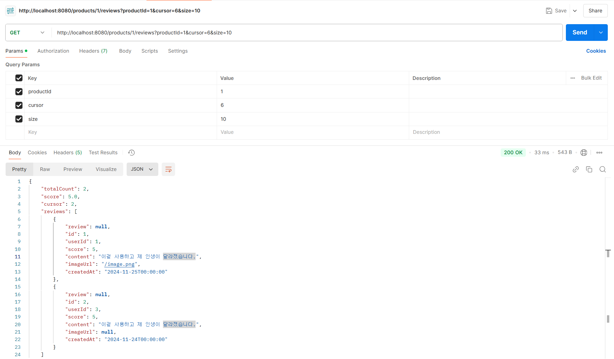
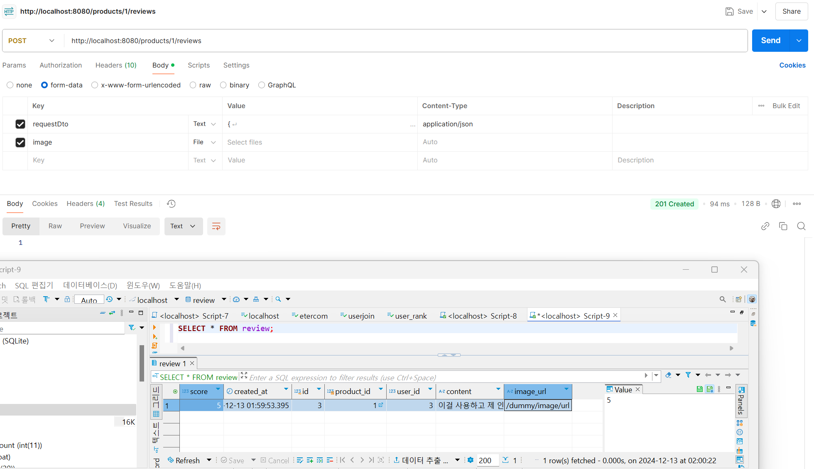
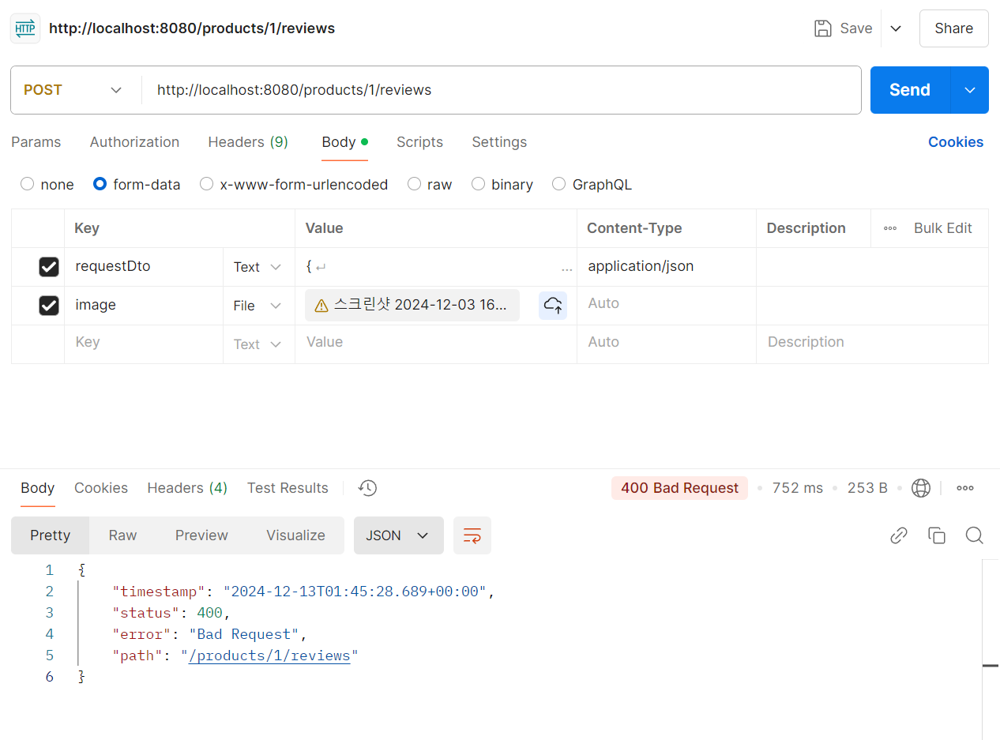
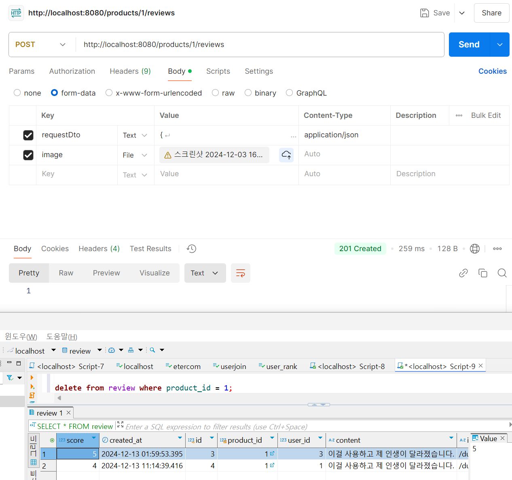

# 기업과제 1번 : 리뷰 서비스
- 개발환경 : SpringBoot, JPA, MySql, Docker
- 8조 : 김민주, 정닛시, 양한서

## 과제 설명

- 상품에 대한 review를 작성하고, 상품별 review 점수, 개수, 그리고 리뷰 내용을 관리합니다.
__ __ __ __ __ __ __

## 비즈니스 요구 사항

- 리뷰는 존재하는 상품에만 작성할 수 있습니다.
- 유저는 하나의 상품에 대해 하나의 리뷰만 작성 가능합니다.
- 유저는 1~5점 사이의 점수와 리뷰를 남길 수 있습니다.
- 사진은 선택적으로 업로드 가능합니다.
    - 사진은 S3 에 저장된다고 가정하고, S3 적재 부분은 dummy 구현체를 생성합니다.
      (실제 S3 연동을 할 필요는 없습니다.)
- 리뷰는 '가장 최근에 작성된 리뷰' 순서대로 조회합니다.
__ __ __ __ __ __ __

## 기술적 요구 사항

- Mysql 조회 시 인덱스를 잘 탈 수 있게 설계해야 합니다.
- 상품 테이블에 reviewCount 와 score 가 잘 반영되어야 한다.
- (Optional) 동시성을 고려한 설계를 해주세요. 많은 유저들이 동시에 리뷰를 작성할 때, 발생할 수 있는 문제를 고려해보세요.
- (Optional) 테스트 코드를 작성하면 좋습니다.
__ __ __ __ __ __ __

# 개발 회고

# 1일차 - 2024-12-11

- Docker 개발 환경설정 완료
- 기본 프로젝트 구조 만들기 (dto, controller, entity, repository, service)

# 팀원 분들의 feedback

- `docker` 환경 설정이 되지 않아서 팀원들에게 도움을 얻었습니다.
- `docker-compose.yml`에 DB 정보가 있어서 보안상의 이유로 `gitignore`를 하였습니다.
- `docker-compose.yml`의 소스 코드는 팀원 피드백에 있는 `docker-compose.yml`을 참고해주세요.

1. 정닛시 님의 피드백

- 도커 명령어

```
7:58 PM
docker run -d -p 3306:3306 -e MYSQL_ROOT_PASSWORD=1234 --name mysql mysql

8:01 PM
docker images

8:02 PM
docker exec -it mysql bash

8:07 PM
docker rm -f $(docker ps -aq)
```

dockerfile

```
FROM openjdk:17-jdk
WORKDIR /app

COPY build/libs/review-0.0.1-SNAPSHOT.jar app.jar
EXPOSE 8080
ENTRYPOINT ["java", "-jar", "app.jar"]
```

docker-compose.yml

```
services:
  database:
    container_name: mysql_db
    image: mysql
    restart: unless-stopped
    environment:
      MYSQL_ROOT_PASSWORD: ****
      MYSQL_DATABASE: review
    ports:
      - "3307:3306"
    volumes:
      - ./mysql/conf.d:/etc/mysql/conf.d # MySQL 설정 파일 위치
    command:
      - "mysqld"
      - "--character-set-server=utf8mb4"
      - "--collation-server=utf8mb4_general_ci"
    networks:
      - test_network

  application:
    container_name: docker-compose-test
    restart: on-failure
    build:
      context: ./
      dockerfile: Dockerfile
    ports:
      - "8080:8080"
    environment:
      SPRING_DATASOURCE_URL: jdbc:mysql://mysql_db:3306/review?useSSL=false&allowPublicKeyRetrieval=true
      SPRING_DATASOURCE_USERNAME: "root"
      SPRING_DATASOURCE_PASSWORD: "****"
    depends_on:
      - database
    networks:
      - test_network

networks:
  test_network:

```
2. 양한서 님의 피드백

- 참고 ref : https://jandari91.tistory.com/104

__ __ __ __ __ __ __


# 2일차 - 2024-12-12
- Service 구현
- review controller 수정 및 이름 수정
- entity 수정

```
문제에 대해서 잘못 이해하고 있었다.
기존에 주어진 것과 다르게 리뷰를 작성할 때 있어야 할 거 같은 칼럼들을 자유롭게 추가했었다.
하지만 기본적으로 조회 시 제공되는 JSON 형식의 파일이 제공되었기 때문에
이것에 맞춰서 entity를 구현해야 했다.

그래서 entity를 수정하였다.
```

# 2일차 기술 매니저님의 feedback
1. 자바 변수명 컨벤션에 지켜서 적기 (자주 하는 실수인데 꼭 지키도록 명심하기!)
2. readme 작성
3. entity 수정하기

전체 팀원 feedback 기록

```
1. 도커 컴포즈 나눠서 사용가능
하나는 계속 띄우게 - db나 이제 계속 떠있는 것
자바 소스 바꾸면 자동 빌드하게 도커 설정 가능

2. 리드미
문제에 대한 분석 그리고 왜 이걸 사용했는지, 나의 의도가 담겨 있어야 함
리드미 먼저 작성하면
트러블 슈팅이 있을 때, 작성하기 수월하다.
기획단계부터 리드미 작성하고 수정해 나가는 걸 추천해주심

3. 이미지가 들어왔을 때 url 처리 되는 것 더미 처리 → 로컬에 저장해보고 불러와 보는 것도 해보면 좋을 듯?
이미지 하나에 대한 이유도 read me 에 작성해주면 좋을 듯.

4 예외 핸들링은 굳이 안해도 되고 optional 까지 끝내고 하는게 좋다.

5. 테스트 코드 유닛테스트, 통합테스트 둘 다 작성되면 좋을 듯.
단위 테스트는 일반적으로 메인 로직이 있는 서비스만 해도 될듯 커버리지 100%

6. user entity 작성에 대해서 read me 에서 내가 왜 그렇게 했는지 설명해주면 될 듯. 
db에 넣어서 user를 더미데이터로 하는게 어떨지
```

# entity 설명

`Product` Entity

```
public class Product {
    @Id
    @GeneratedValue(strategy = GenerationType.IDENTITY)
    private Long id;

    private String name;

    private int reviewCount;

    private float score;
}
```

`Review` Entity

```
public class Review {

    @Id
    @GeneratedValue(strategy = GenerationType.IDENTITY)
    private Long id;

    @ManyToOne(fetch = FetchType.LAZY)
    @JoinColumn(name = "product_id", nullable = false)
    private Product product;

    private Long userId;

    private int score;

    private String content;

    private String imageUrl;

    private LocalDateTime createdAt = LocalDateTime.now();

    @Builder
    public Review(ReviewRequestDto requestDto, Product product, String imageUrl) {
        this.product = product;
        this.userId = requestDto.getUserId();
        this.score = requestDto.getScore();
        this.content = requestDto.getContent();
        this.imageUrl = imageUrl;
    }
}
```

- JSON 기재된 파일을 참고하여 `Product` 와 `Review` entity를 구현하였습니다.
- `Review`와 `Product`는 N : 1 관계를 가지고 있습니다.

__ __ __ __ __ __ __

# 3일차 - 2024-12-13

1. postman으로 GET API(리뷰 조회) 테스트 완료



2. 새벽에 postman으로 POST API(리뷰 작성) 테스트 완료



3. 일어나서 다시 테스트를 하는데 오류 발생.



dto에 선언을 제대로 해주지 않아서 일어난 문제였다.

기존 dto

```
public class ReviewRequestDto {
    private Long userId;
    private int score;
    private String content;
}
```

변경된 dto

```
public class ReviewRequestDto {
    private Long id;
    private Long userId;
    private int score;
    private String content;
    private String imageUrl;
    private LocalDateTime createdAt;
}
```
정상적으로 돌아가는 POST API TEST



- 다만, 리뷰 작성 POST 부분에서 문제점이 발생하였습니다. 
- 이미지 파일을 DB에서 `/dummy/image/url` 로 저장되고 있습니다.
- 따라서 이 부분에 대한 수정이 필요합니다.